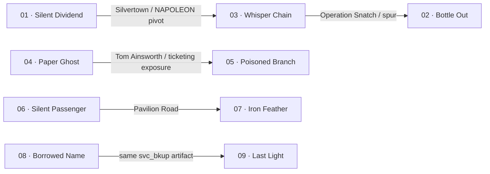
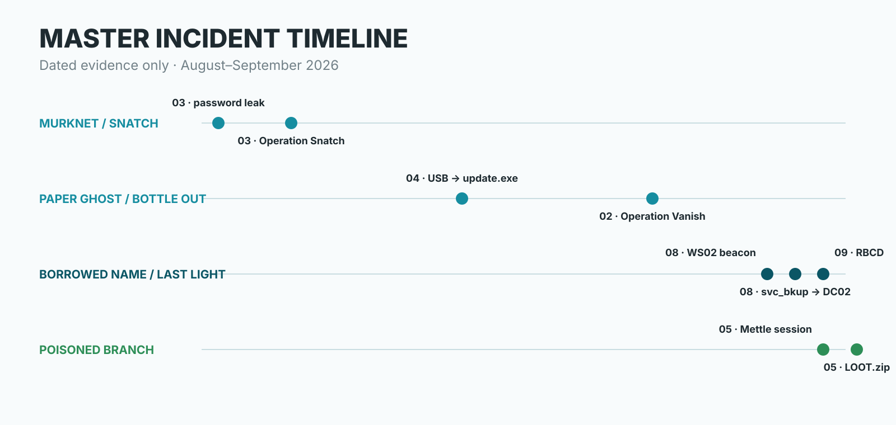

<p align="center">
  
</p>

<h1 align="center">HOLMES CTF 2026 — The Reichenbach Directive</h1>

<p align="center">
  <strong>A Complete DFIR Investigation of Operation DIOGENES</strong><br>
  <sub>MichelDV · InFracturaVeritas · Exploit Bag Chaser</sub>
</p>

<p align="center">
  
  
  
  
  
</p>

---

## Overview

This repository is the publication edition of my investigation into **Hack The Box HOLMES CTF 2026 — The Reichenbach Directive**.

Rather than presenting nine disconnected challenge solutions, the material is organized as a single incident investigation spanning endpoint forensics, threat intelligence, malware analysis, reverse engineering, Android/embedded analysis, UAV forensics, Active Directory, Kerberos, blockchain-assisted abuse, and cross-case correlation.

### Official result

| Metric | Result |
|---|---:|
| Team | **Exploit Bag Chaser** |
| Participant | **MichelDV / InFracturaVeritas** |
| Team rank | **#211 / 5,637** |
| Validated tasks | **104 / 111** |
| Total points | **8,200** |
| Fully completed Sherlocks | **6 / 9** |
| Event dates | **17–21 September 2026** |

> **Reproducible enough to trust the findings, not exhaustive enough to reproduce the analyst's entire workflow.**

## Read the investigation

| Edition | Link | Best for |
|---|---|---|
| **Canonical Markdown** | **[Read the complete master investigation →](reports/HOLMES_2026_The_Reichenbach_Directive.md)** | GitHub reading, searchable technical detail and future corrections |
| **Publication PDF** | **[Open / download the designed PDF →](reports/HOLMES_2026_The_Reichenbach_Directive_PUBLICATION_FINAL_RELEASE.pdf)** | Offline reading, portfolio sharing and the fixed publication layout |
| **Case index** | **[Browse all nine Sherlocks →](cases/README.md)** | Fast case-by-case navigation, status and cross-case pivots |

The Markdown edition is the canonical public analysis. The PDF is the designed publication snapshot and includes the official competition certificate as its final page.

## Cross-case investigation map

Several links between Sherlocks are independently supported by evidence recovered in separate cases:



## Sherlock coverage

| # | Sherlock | Status | Primary focus |
|---:|---|---:|---|
| 01 | [Silent Dividend](cases/01-silent-dividend.md) | **10/10** | Electron malware, LuaJIT, Ethereum/Sepolia |
| 02 | [Bottle Out](cases/02-bottle-out.md) | **10/10** | Windows endpoint forensics, XMPP, anti-forensics |
| 03 | [Whisper Chain](cases/03-whisper-chain.md) | **7/8** | XMPP threat intelligence, encrypted command infrastructure |
| 04 | [Paper Ghost](cases/04-paper-ghost.md) | **9/9** | Removable-media intrusion, SRUM, Windows Search / ESENT |
| 05 | [Poisoned Branch](cases/05-poisoned-branch.md) | **15/15** | Software supply chain, Linux implant, loot recovery |
| 06 | [Silent Passenger](cases/06-silent-passenger.md) | **16/20** | Android firmware, staged malware, mobile proxy infrastructure |
| 07 | [Iron Feather](cases/07-iron-feather.md) | **17/17** | PX4 UAV, custom KDF, AES-GCM, flight reconstruction |
| 08 | [Borrowed Name](cases/08-borrowed-name.md) | **12/12** | AdaptixC2, Active Directory abuse, lateral movement |
| 09 | [Last Light](cases/09-last-light.md) | **8/10** | Memory forensics, Kerberos, forged tickets, RBCD |
|  | **Total** | **104/111** | **6/9 fully completed** |

## Technical highlights

The investigation includes:

- deleted-file and NTFS metadata recovery;
- Windows Registry, SRUM, ConsentStore and Search Index analysis;
- low-level ESENT long-value recovery and XPRESS decoding;
- XMPP MAM/pubsub reconstruction and encrypted command decryption;
- Electron/LuaJIT malware analysis;
- Ethereum smart-contract and wallet-drainer investigation;
- Linux supply-chain compromise and Mettle/Metasploit reconstruction;
- ZipCrypto known-plaintext recovery;
- Android firmware analysis, MQTT abuse, staged JAR/DEX recovery and relay-protocol analysis;
- PX4 firmware reverse engineering, custom KDF recovery and authenticated AES-GCM decryption;
- UAV mission-intent vs observed-flight reconstruction;
- AdaptixC2 and Active Directory attack-chain reconstruction;
- access-token analysis, forged Kerberos tickets and Resource-Based Constrained Delegation;
- cross-case validation using identical artifacts recovered from independent evidence sources.

## Master incident timeline

<p align="center">
  
</p>

## Evidentiary model

| Label | Meaning |
|---|---|
| **FACT** | Directly supported by one or more artifacts |
| **CORRELATION** | Supported by independent evidence across artifacts or cases |
| **INFERENCE** | Reasoned interpretation consistent with the evidence |
| **OPEN** | Technically reconstructed, but not fully validated by the challenge platform |

## Repository structure

```text
holmes-ctf-2026-reichenbach-directive/
├── README.md
├── DISCLAIMER.md
├── LICENSE.md
├── CITATION.cff
├── CONTRIBUTING.md
├── CHANGELOG.md
├── reports/
│   ├── HOLMES_2026_The_Reichenbach_Directive.md
│   └── HOLMES_2026_The_Reichenbach_Directive_PUBLICATION_FINAL_RELEASE.pdf
├── cases/
│   ├── README.md
│   ├── 01-silent-dividend.md
│   ├── 02-bottle-out.md
│   ├── 03-whisper-chain.md
│   ├── 04-paper-ghost.md
│   ├── 05-poisoned-branch.md
│   ├── 06-silent-passenger.md
│   ├── 07-iron-feather.md
│   ├── 08-borrowed-name.md
│   └── 09-last-light.md
├── assets/
│   ├── cover.webp
│   └── master-timeline.svg
└── .github/
    └── ISSUE_TEMPLATE/
```

## Evidence and redistribution policy

This repository contains **original analysis, write-ups and graphics**. It intentionally does **not** redistribute Hack The Box challenge packages or raw evidence such as E01/disk images, memory dumps, PCAPs, firmware packages, malware binaries, challenge ZIP archives, or original briefing files.

See [DISCLAIMER.md](DISCLAIMER.md) for scope and attribution.

## Author

**MichelDV / InFracturaVeritas**  
GitHub: **[@Michel-DV](https://github.com/Michel-DV)**

## Citation

If this investigation is useful to your research, teaching or defensive-security work, please cite the repository using [`CITATION.cff`](CITATION.cff).

---

<p align="center">
  <sub>HOLMES CTF 2026 · The Reichenbach Directive · DFIR / Threat Intelligence / Reverse Engineering</sub>
</p>
