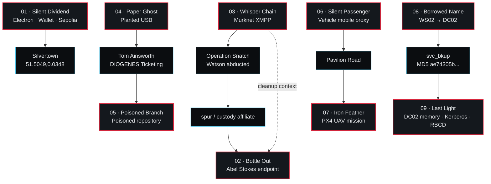
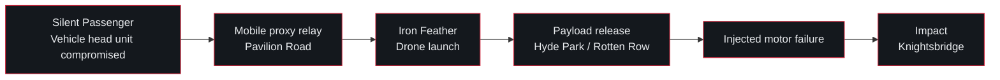

# HOLMES CTF 2026 — The Reichenbach Directive
## A Complete DFIR Investigation of Operation DIOGENES

**Analyst:** Michel-DV · HTB: InFracturaVeritas  
**Team:** Exploit Bag Chaser  
**CTF dates:** 17/09/2026 - 21/09/2026  
**Environment:** Kali Linux virtual machine  
**Methodology:** Evidence-driven DFIR · threat hunting · reverse engineering  
**Competition result:** **Exploit Bag Chaser · solo participant/team of one · #211 / 5,637 teams · 104 / 111 flags · 8,200 points**  
**Completion:** **6 / 9 Sherlocks fully solved · 93.69% of all flags validated**

> **Nine investigations. One operation.**

---

## Publication Note

This report consolidates nine separate HOLMES CTF 2026 Sherlock investigations into a single cross-case forensic case study. It is not a concatenation of individual write-ups. The emphasis is on evidence, reconstruction, correlation and analytical reasoning.

Commands, local workflow details and repetitive challenge-specific troubleshooting are intentionally minimized. Exact hashes, timestamps, hostnames, addresses, credentials, protocol values and other evidentiary details are retained where they materially support a finding.

Nine audited case reports were used as source records during consolidation. Their SHA-256 hashes are retained in Appendix C for provenance; this repository publishes the consolidated master report as the canonical public analysis, with lightweight case navigation pages for each Sherlock.

---

# Executive Summary

The Reichenbach Directive presented nine investigations that initially appeared to occupy different technical domains: Windows endpoint forensics, XMPP infrastructure, removable-media compromise, Linux supply-chain intrusion, Android malware, UAV telemetry, Active Directory abuse, memory forensics and blockchain-assisted theft.

Taken together, the evidence describes a broader operation centered on **DIOGENES** and repeatedly associated with **NAPOLEON** infrastructure, operator identities, staging nodes, physical access, credential abuse, covert communications and post-compromise cleanup.

The nine cases can be understood as several connected operational threads rather than nine isolated puzzles.

The first thread begins with **Silent Dividend**, where a malicious Electron application combined a LuaJIT implant with Ethereum Sepolia smart contracts. The malware monitored wallet-related secrets and used on-chain state to obtain a decryption key. The contract chain also exposed the geographic pivot `51.5049,0.0348`, placing the operation in **Silvertown**.

A second thread centers on **Watson's abduction and the Murknet XMPP environment**. **Whisper Chain** recovered member credentials from OPSEC failures, exposed hidden operational rooms, decrypted all 18 pubsub command items and reconstructed **Operation Snatch**. The custody affiliate `spur` connects directly to **Bottle Out**, where a seized laptop revealed Tactical RMM, OpenVPN, Gajim credentials, Operation Vanish and the operator identity **Abel Stokes**.

A third thread shows DIOGENES personnel being targeted through physical and software supply-chain compromise. **Paper Ghost** reconstructed a planted USB attack against `CO-LT-0469`, recovered microphone and webcam surveillance activity, and extracted sensitive DIOGENES records from `Windows.edb` using custom ESENT parsing. Those records exposed developer **Tom Ainsworth** and his ticketing credentials. **Poisoned Branch** then showed Ainsworth compromised through a poisoned `diogenes-ticket-parser` repository, a runtime-reconstructed Mettle implant, operator infrastructure at `BlackPearl2026.htb`, and an encrypted `LOOT.zip` recovered without its password through a ZipCrypto known-plaintext attack.

A fourth thread moves from ground infrastructure to mobile and aerial platforms. **Silent Passenger** reconstructed a staged Android compromise inside an Allwinner T3/TOPWAY vehicle head unit. A privileged TWCore application used MQTT to deliver `com.tw.jar1`, which reconstructed additional stages, retrieved RSA-protected tasking and ultimately loaded `sh66.io`, turning the vehicle into a **mobile proxy relay**. **Iron Feather** then recovered the mission and real flight of a PX4 quadcopter launched from the same **Pavilion Road** area. Its dataman and ULog evidence had been protected with a custom AES-256-GCM format and KDF. After decryption, the mission showed a payload release near Hyde Park / Rotten Row and a return flight interrupted by an injected `MAV_CMD_INJECT_FAILURE`, ending with an impact on Knightsbridge.

The final thread is the enterprise compromise. **Borrowed Name** reconstructed an intrusion from removable media on `WS02`, DLL side-loading, AdaptixC2, Active Directory discovery, Internal Monologue-style credential access, ResetNightmare abuse and lateral movement to `DC02`. The attacker uploaded `svc_bkup` through `ADMIN$` and executed it through a temporary service-path modification. **Last Light** begins with that same binary already resident on the Domain Controller. The exact `svc_bkup` artifact was reconstructed from memory and matched the earlier file. From there, memory and event-log evidence exposed token impersonation, a forged root-domain TGT, machine-account creation, Resource-Based Constrained Delegation and an S4U-derived `cifs/DC02` ticket.

The resulting portfolio demonstrates not one narrow toolset, but the ability to move between evidence types while maintaining a consistent evidentiary standard:

- filesystem and deleted-file recovery;
- Windows Registry, SRUM, ConsentStore and Search Index analysis;
- XMPP/MAM/pubsub investigation;
- malware and protocol reverse engineering;
- smart-contract and wallet-drainer analysis;
- Linux endpoint and operator-server forensics;
- Android firmware and staged payload reconstruction;
- custom cryptographic KDF recovery;
- PX4 dataman and ULog reconstruction;
- packet analysis and C2 reverse engineering;
- Active Directory and Kerberos abuse analysis;
- memory forensics and cross-case artifact validation.

The final result was **104 validated flags out of 111**, with **six of nine Sherlocks fully solved**.

---

# 1. Investigation Scope and Methodology

## 1.1 Evidence handling

Original evidence was treated as immutable. Analysis was performed on working copies in a Kali Linux virtual machine using a dedicated DFIR, reverse-engineering, network-analysis and malware-analysis toolchain.

The governing principle throughout the investigation was:

> **Reproducible enough to trust the findings, not exhaustive enough to reproduce the analyst's entire workflow.**

This distinction matters. A forensic report should expose the chain of evidence necessary to understand and validate a conclusion, but it does not need to preserve every exploratory command, failed hypothesis or local implementation detail.

## 1.2 Analytical model

Findings in this report fall into four categories:

| Label | Meaning |
|---|---|
| **FACT** | Directly supported by one or more artifacts |
| **CORRELATION** | Supported by multiple artifacts or cases whose relationship is independently observable |
| **INFERENCE** | A reasoned interpretation consistent with the evidence but not directly encoded in a single artifact |
| **OPEN** | Technically reconstructed evidence exists, but a challenge value remains unvalidated or incomplete |

Platform acceptance is treated as an additional validation signal, not as a substitute for forensic reasoning.

## 1.3 Time normalization

Where timestamps were available, they were normalized to UTC in the underlying case reports. Some investigations, especially Silent Passenger and Iron Feather, contain relative or simulator-derived time rather than a complete campaign calendar timestamp. Those events are preserved as relative sequences instead of being forced into a false absolute chronology.

## 1.4 Cross-validation

The strongest findings in the investigation are those that survive independent validation.

Examples include:

- `.integrity` on Tom Ainsworth's host matching `reverse.bin` on the operator server;
- `svc_bkup` recovered from DC02 memory matching the binary transferred in Borrowed Name;
- the Iron Feather AES key validating the GCM authentication tag on both encrypted evidence containers;
- Paper Ghost's USB path appearing across UserAssist, ConsentStore and SRUM;
- Whisper Chain's member credentials emerging from two independent OPSEC leaks rather than brute force;
- Bottle Out's deleted VPN/XMPP data being reconstructed from surviving NTFS and application artifacts after Operation Vanish.

## 1.5 Investigation outcome

| Sherlock | Difficulty | Validated | Primary discipline |
|---|---|---:|---|
| S01 — Silent Dividend | Medium | **10/10** | Windows / Electron / blockchain |
| S02 — Bottle Out | Easy | **10/10** | Windows endpoint / XMPP / anti-forensics |
| S03 — Whisper Chain | Medium | **7/8** | XMPP / threat intelligence |
| S04 — Paper Ghost | Hard | **9/9** | Windows DFIR / search-index recovery |
| S05 — Poisoned Branch | Hard | **15/15** | Linux / supply chain / loot recovery |
| S06 — Silent Passenger | Hard | **16/20** | Android / staged malware / proxying |
| S07 — Iron Feather | Hard | **17/17** | UAV / cryptography / flight forensics |
| S08 — Borrowed Name | Insane | **12/12** | Active Directory / C2 / lateral movement |
| S09 — Last Light | Insane | **8/10** | Memory / Kerberos / RBCD |
| **Total** |  | **104/111** |  |

Seven tasks remain open: Whisper Chain T8; Silent Passenger T13, T14, T19 and T20; Last Light T2 and T3.

---

# 2. The Reichenbach Directive — Incident Overview

The evidence is best understood as a set of operational threads converging on DIOGENES personnel, infrastructure and access.



## 2.1 Strongest cross-case links

| Cases | Correlation | Confidence |
|---|---|---|
| S03 → S02 | `spur` is the custody affiliate in Operation Snatch and the operator context on the seized laptop; Murknet appears in both cases | **High** |
| S04 → S05 | Paper Ghost exposes Tom Ainsworth and DIOGENES ticketing credentials; Poisoned Branch compromises Ainsworth through a ticket-parser supply-chain lure | **High** |
| S06 → S07 | Pavilion Road is the location associated with the compromised vehicle and the drone's launch/home position | **High** |
| S08 → S09 | `svc_bkup` transferred to DC02 in Borrowed Name is reconstructed from memory in Last Light with matching artifact identity | **Very High** |
| S01 → wider campaign | `AUTH=NAPOLEON`, settlement reference and Silvertown coordinates align with the broader operation | **High** |

The report deliberately avoids forcing weaker narrative relationships where artifact-level support is absent.

---

# 3. Master Incident Timeline

The cases do not all provide a single absolute calendar chronology. The timeline below therefore separates dated evidence from relative operational chains.

## 3.1 Dated evidence

| Date / Time (UTC) | Case | Event |
|---|---|---|
| **2026-08-02 16:30** | Whisper Chain | Historical temporary passwords exposed in Murknet `Infrastructure` |
| **2026-08-02 18:47** | Whisper Chain | Onboarding PDF published with `zytglogge88@murknet.htb` in metadata |
| **2026-08-04 13:20** | Whisper Chain | Operation Sparkling begins |
| **2026-08-06 23:22** | Whisper Chain | Operation Snatch dispatcher key rotates to `SHALLOWBLUE` |
| **2026-08-07 07:38** | Whisper Chain | Operation Snatch begins |
| **2026-08-07 10:50** | Whisper Chain | `dynamite` starts the operation against Watson |
| ~**2026-08-07 12:33** | Whisper Chain | Watson delivered to `spur` at container `75JM77` in Silvertown |
| **2026-08-07 20:18** | Whisper Chain | `spur` reports the site discovered and flees |
| **2026-08-07 20:21** | Whisper Chain | Immediate cleanup ordered |
| **2026-08-19 15:35:50** | Paper Ghost | Lexar USB registered on `CO-LT-0469` |
| **2026-08-19 15:36:25** | Paper Ghost | `update.exe` executed from removable media |
| **2026-08-19 15:38:08** | Paper Ghost | Microphone capture begins |
| **2026-08-19 15:42:28** | Paper Ghost | Webcam capture begins |
| **2026-09-01 08:33** | Bottle Out | Windows Security log cleared |
| **2026-09-01 12:37:40–12:37:47** | Bottle Out | Operation Vanish removes Gajim/OpenVPN/VPN artifacts |
| **2026-09-09 20:32:33** | Borrowed Name | AdaptixC2 beacon checks in from `WS02` |
| **2026-09-09 20:44:11** | Borrowed Name | Internal Monologue-style NetNTLMv2 extraction |
| **2026-09-09 20:46:47** | Borrowed Name | ResetNightmare resets `jreed` password |
| **2026-09-09 20:49:36** | Borrowed Name | `svc_bkup` uploaded to DC02 and `defragsvc` modified |
| **2026-09-09 20:49:57** | Borrowed Name | SYSTEM beacon established from DC02 |
| **2026-09-09 22:19:51** | Last Light | Forged root-domain TGT observable in LSASS |
| **2026-09-09 22:35:44** | Last Light | Machine account `svc_bkup$` created |
| **2026-09-09 22:38:41** | Last Light | RBCD attribute written on `DC02` |
| **2026-09-09 22:39:43** | Last Light | S4U-derived `cifs/DC02` service ticket observed |
| **2026-09-09 22:40:38** | Last Light | DC02 memory acquired |
| **2026-09-15 15:20:21** | Poisoned Branch | Mettle handler/session active against Tom Ainsworth |
| ~**2026-09-15 15:40** | Poisoned Branch | HR roster collected |
| **2026-09-15 15:40:57** | Poisoned Branch | HR roster deleted from victim |
| **2026-09-15 15:43** | Poisoned Branch | `LOOT.zip` created on operator infrastructure |

## 3.2 Relative operational chain



Silent Dividend also contributes a geographic pivot into Silvertown but does not provide a campaign timestamp suitable for placement into the dated sequence.

---

# 4. Sherlock 01 — Silent Dividend
## Electron Malware, On-Chain Key Retrieval and Wallet Draining

### Case Context

Silent Dividend opens the investigation with a hybrid endpoint-and-blockchain attack. The apparent application, `TrustSettle 1.0.0.exe`, is an Electron settlement client. Its user-facing behavior is plausible, but its preload script also has direct access to Node.js capabilities because the application runs with permissive Electron settings.

### Evidence

The preload stages `api.txt`, `luajit.exe`, `lua51.dll` and `.env` into `C:\Users\Public`, then launches the Lua implant through hidden PowerShell.

The LuaJIT implant uses FFI rather than a conventional native wrapper. It loads `kernel32` and `winhttp`, monitors filesystem changes through `ReadDirectoryChangesW`, interprets the resulting buffer as `FILE_NOTIFY_INFORMATION`, and opens `C:\Users\Public\.env` for reading.

The `.env` lure is particularly significant because the supplied instructions direct the user to populate it with wallet-related values such as:

```text
PRIVATE_KEY
WALLET_ADDRESS
RPC_URL
```

Remote transmission is implemented through the WinHTTP stack, including `WinHttpSendRequest`.

### On-chain control path

The Electron preload also queries the Sepolia `StateRegistry` contract:

```text
0xbB63Ae28E4f75C9392bae69cDf5394Ca0ACdA6B1
```

through:

```text
resolveState()
```

The returned `bytes32` value is the decryption key for an embedded command. Decrypting the payload reveals:

```text
AUTH=NAPOLEON SETTLEMENT_REFERENCE=SR-4821
```

and opens `%TEMP%\settlement.html`.

The settlement page uses `ethers.BrowserProvider`, requests an unlimited ERC-20 allowance through `approve()`, and sets the amount to `MaxUint256`.

The associated drainer contract:

```text
0x69Bf5b7aBA51C3Ee8bF169aB47479ba95DBF709D
```

derives its hidden owner as:

```text
0xEBfC1eD96b1C6b940fb6B06359fF4A6776Df7a9A
```

The same contract path exposes:

```text
51.5049,0.0348
```

which places the operation in Silvertown.

### Key Finding

Silent Dividend is not simply wallet phishing. The endpoint implant, on-chain key retrieval and approval-drainer flow are mutually supporting components of a single attack chain.

### Detection Opportunities

- alert on hidden PowerShell spawning `luajit.exe`;
- monitor execution or script content from `C:\Users\Public`;
- detect non-browser processes reading wallet `.env` files;
- monitor unexpected WinHTTP activity from LuaJIT;
- enforce Electron hardening such as `contextIsolation`;
- inspect high-risk ERC-20 allowance requests, especially `MaxUint256`;
- monitor enterprise endpoints interacting with unapproved blockchain RPC services where relevant.

### Validation

**10/10 tasks validated.**

---

# 5. Sherlock 02 — Bottle Out
## Windows Endpoint and XMPP Artifact Forensics

### Case Context

Bottle Out examines the laptop associated with Watson's jailer. The host was configured as an operational endpoint rather than a conventional workstation.

### Evidence

Three communication layers were visible:

- **Tactical RMM Agent v.2.11.0** connected to `api.antimattercommunication.xyz`;
- **OpenVPN** connected to `18.156.81.166:7577`, with CA `NPLN-CA` and assigned address `10.129.175.2`;
- **Gajim Portable 2.6.0** used the account `spurio9@murknet.htb` with password `spur999!*`.

The laptop therefore connects directly to the Murknet infrastructure explored in Whisper Chain.

Browser Local Storage exposed the operator identity associated with the laptop:

```text
Abel Stokes
Abel.stokes@hotmail.com
```

### Operation Vanish

At 12:37 UTC on 1 September 2026, an encoded PowerShell cleanup routine recursively deleted Gajim, OpenVPN and VPN directories.

The first accepted command was:

```text
Remove-Item -LiteralPath C:\Users\spur\Gajim -Recurse -Force
```

Deletion did not destroy the investigation. Deleted NTFS records, surviving dataruns, registry state, PowerShell logging, application databases and browser storage were sufficient to recover the core communications stack and identity.

A separate Security log-clearing event earlier in the day further reduced visibility but did not remove the principal evidence.

### Cross-case Significance

Bottle Out provides the physical endpoint behind the `spur` identity seen in Whisper Chain. It is the strongest endpoint-side anchor for the Watson custody thread.

### Detection Opportunities

- alert on newly installed remote-management agents on short-lived or operational workstations;
- correlate OpenVPN deployment with newly created local accounts;
- monitor Gajim or other XMPP clients in environments where they are not authorized;
- detect recursive PowerShell deletion of communication/VPN directories;
- alert on Security log clearing and correlate it with subsequent administrative activity;
- preserve NTFS metadata and USN Journal evidence during containment.

### Validation

**10/10 tasks validated.**

---

# 6. Sherlock 03 — Whisper Chain
## XMPP Threat Intelligence and APT Coordination

### Case Context

Whisper Chain moves from endpoint artifacts into the APT's live coordination environment. The meaningful evidence was hosted on `murknet.htb` and its related XMPP components.

### Infrastructure

The self-signed certificate identified:

```text
murknet.htb
groups.murknet.htb
command.murknet.htb
upload.murknet.htb
```

Public rooms were:

```text
Infrastructure
Random
Resources
Rules
```

The public message archive contained 466 unique messages.

### Credential recovery through OPSEC failure

The pivotal access path required no protocol exploit and no brute force.

A historical password list leaked:

```text
KillBill2025!
K4w4Bong424!
Northwind225!
TickTock24!
```

Meanwhile, metadata in `Operational_Onboarding_Guide_v3.2.pdf` exposed:

```text
Author  = zytglogge88@murknet.htb
Creator = swissclock
```

Correlating the `swissclock` identity with the leaked password `TickTock24!` produced valid credentials:

```text
zytglogge88@murknet.htb:TickTock24!
```

### Hidden operations

Authenticated access exposed:

```text
Operation Sparkling
Operation Snatch
```

Operation Snatch coordinated Watson's surveillance, abduction, transportation and detention.

`dynamite` handled transport, while `spur` took custody. The evidence placed Watson in container:

```text
75JM77
```

with watchword:

```text
Chaos Is Order
```

The command dispatcher used encrypted pubsub items encoded as Base64 `Salted__` blobs. The encryption path was reconstructed as PBKDF2-HMAC-SHA256 followed by AES-256-CBC. All **18/18 command items** were decrypted.

### OSINT correlation

The actor alias `rattlesnake` correlated with the social identity **Porlock**, and the investigation recovered cryptocurrency addresses and infrastructure associated with the wider operation.

### Cross-case Significance

`spur` is the custody affiliate in Operation Snatch and the operational identity connected to the laptop in Bottle Out.

The cleanup instruction observed in the command stream is consistent with the later anti-forensic behavior on that endpoint, but the report treats the later Operation Vanish event as corroborating context rather than claiming a direct one-to-one execution of the earlier command.

### Detection Opportunities

- inventory and monitor XMPP clients and outbound XMPP/STARTTLS in enterprise environments;
- detect unauthorized access to `groups.*`, `command.*` and `upload.*`-style service components;
- inspect exposed document metadata before publication;
- enforce secret rotation and prevent operational passwords from appearing in chat;
- use infrastructure and account correlation across messaging, endpoint and network telemetry.

### Validation

**7/8 tasks validated.**

Open: **T8** — evidence supports **Operation Snatch / kidnapping Watson**, but the expected validator representation was not identified.

---

# 7. Sherlock 04 — Paper Ghost
## Planted USB, Endpoint Surveillance and Search-Index Recovery

### Case Context

Paper Ghost reconstructs a targeted physical intrusion against `CO-LT-0469`, used by `cvoss` in the Ministerial Briefing Office.

The planted device was a Lexar USB registered as:

```text
CO-USB-0091
Serial: RS200000000627E4&0
```

The false contractor identity was:

```text
Elias Venn
EXT-0431
```

### Initial access and execution

The USB presented a plausible workstation-specific support package:

```text
E:\CO-LT-0469 update package\update.exe
```

The device registered at approximately 15:35:50 UTC on 19 August 2026. UserAssist records one execution of `update.exe` at 15:36:25.

### Surveillance and exfiltration

ConsentStore recorded:

```text
Microphone start: 15:38:08
Webcam start:     15:42:28
Webcam duration:  126.9805499 s
```

SRUM attributed:

```text
172,064,531 bytes sent
172.064531 MB outbound
```

to the malicious executable.

The supplied triage did not contain packet captures or firewall telemetry, so the exact C2 destination is not asserted.

### Windows Search as residual evidence

The case's most important forensic technique was the recovery of DIOGENES content from `Windows.edb`.

The original files were absent, but `System_Search_AutoSummary` retained indexed content as ESENT long values. Standard `libesedb` handling could not resolve the relevant 8-byte long-value keys.

A custom parser reconstructed the long-value B-tree records and decoded compressed chunks using XPRESS LZ77 and bit-packed data recovery.

Six DIOGENES documents were recovered, including the personnel/access record for:

```text
Tom Ainsworth
Software Developer
DIOGENES Ticketing Support
```

and:

```text
tainsworth:D10g3n3s_T1ck3ts#2026
```

### Cross-case Significance

Paper Ghost creates the personnel and credential bridge into Poisoned Branch. It establishes Tom Ainsworth as a DIOGENES ticketing developer and exposes the access context later targeted through a poisoned ticket-parser repository.

### Detection Opportunities

- restrict execution from removable media;
- alert on first-seen USB storage followed immediately by executable launch;
- monitor microphone/webcam ConsentStore activity from unusual non-packaged executables;
- detect anomalous high-volume outbound traffic from removable-media executables;
- remove plaintext credentials from shared documents;
- preserve Windows Search indexes during triage because they can retain deleted or absent content.

### Validation

**9/9 tasks validated.**

---

# 8. Sherlock 05 — Poisoned Branch
## Software Supply-Chain Compromise and Loot Recovery

### Case Context

Poisoned Branch targets Tom Ainsworth through a malicious repository:

```text
diogenes-ticket-parser
```

The author metadata identifies:

```text
Sebastain Moran
cbass.Moran@blackpearl2026.htb
```

### Runtime payload reconstruction

The malicious logic lived inside:

```text
src/ticket_parser/telemetry.py
```

Rather than shipping a recognizable executable, the repository reconstructed its implant at runtime through XOR between:

```text
calibration.bin
diogenes.jpg
```

The output was:

```text
/home/Tom/.cache/.ticket-parser/.integrity
```

The file was a Metasploit Mettle payload configured for:

```text
tcp://blackpearl2026.htb:31337
```

The same binary matched `reverse.bin` found on the operator infrastructure, providing direct cross-validation of the payload lineage.

### Operator activity

Meterpreter history and endpoint audit artifacts reconstruct document discovery, collection and deletion.

The operator searched:

```text
search -d ONBOARDING -f *.pdf
```

collected:

```text
Gov_HR_Continuity_Emergency_Callout_Roster.pdf
```

and deleted it with:

```text
rm Gov_HR_Continuity_Emergency_Callout_Roster.pdf
```

### Moran File Exchange

The operator maintained a Flask/Werkzeug node:

```text
BlackPearl2026.htb:9999
```

protected by the static cookie:

```text
X-Operator-Auth=napoleon_moran_1894
```

The download route allowed path traversal.

### `LOOT.zip`

Stolen material was staged in:

```text
LOOT.zip
SHA256 9faf07cbff1f6ed3b01cc6dbfae2d4a330a2460d88c82a0fa7682ff193479b71
```

The archive used ZipCrypto.

An external plaintext copy of the same `README.txt` provided a known-plaintext condition. Reproducing the corresponding deflate stream allowed recovery of the internal ZipCrypto keys:

```text
85b6bbc1
27824945
ce665bee
```

The archive was therefore decrypted without recovering the original password.

Recovered material included the HR roster and the identity/address of **Sarah Kemp**, whose position was the only one marked `REDACTED`.

### Detection Opportunities

- scan internal and third-party repositories for hidden execution inside telemetry/update code;
- alert on Python writing executable content to hidden cache directories followed by `chmod +x`;
- monitor unusual non-standard outbound ports such as 31337 where policy permits;
- correlate document download with immediate deletion;
- detect newly installed archive tooling or sudden staging of encrypted archives on transfer nodes;
- treat weak archive encryption as insufficient protection for sensitive material.

### Validation

**15/15 tasks validated.**

---

# 9. Sherlock 06 — Silent Passenger
## Android Head-Unit Malware and Mobile Proxy Infrastructure

### Case Context

Silent Passenger examines an Android 8.1 Allwinner T3/TOPWAY automotive head unit.

The compromise begins with a privileged system application:

```text
/system/priv-app/TWCore/TWCore.apk
SHA256 d7569563cd0491e76d28a1c6a9929234ffffcf035194d2288d888dced7aa11c2
```

TWCore runs with `android.uid.system`, has package-install capability and contains MQTT logic.

### MQTT delivery

The affected region uses:

```text
tcp://mqtt.car.cardoor.cn:1883
dofun:dofun666666
dofun/car/config/#
```

A retained update message delivers:

```text
com.tw.jar1
version 12
MD5 6c2e34b30da42085240ede53ab6107d4
```

The APK's recovered MD5 exactly matches the integrity value in the MQTT instruction.

### Staged reconstruction

`com.tw.jar1` reconstructs its next stage from 30 XOR-obfuscated byte arrays.

The reflective entry point is:

```text
com.c.j.qbh.wa
channel 2039
```

The reconstructed `stage2.jar` has:

```text
SHA256 cf5c8c624967775230573a5a552e2e4e2b3653f2362e8c9b66a801e3b251f37c
```

The loader identifies as version `1.7` and contacts:

```text
/api/rsaUpdate
```

through RSA-protected traffic.

The response points to:

```text
/vr34der34/dex3.68.png
```

which is not an image. After XOR recovery it becomes the control-stage JAR:

```text
SHA256 79e01a591c81554b57e0baaf877ca0a1a1f86f39d38973faa1580089b675838d
```

### Control and final proxy module

The first validated configuration request-target is:

```text
/api/init?configVersion=3.8&rsa=1&channelId=2039
```

The control stage performs device registration, task retrieval and module loading.

The final module is:

```text
sh66.io
SHA256 906734ebb9a274c5c83a22a4475e27354857d7b5b62a4ab6bb5d8d365692e963
```

loaded through:

```text
loadlib2:url
```

Its entry point is:

```text
com.miyc.transfer.Client.start
```

with method descriptor:

```text
(Landroid/content/Context;Ljava/lang/String;Ljava/lang/String;IIII)V
```

The accepted integer sequence is:

```text
9919,7717,8818,20000
```

### Mobile proxy role

The final module implements a custom framed relay protocol and accepted sessions against live challenge relay infrastructure.

The decisive conclusion is that the infected vehicle was not simply a beaconing endpoint. It had been converted into a **mobile proxy asset**.

### Cross-case Significance

The narrative places the vehicle at **Pavilion Road car park**, which becomes the launch/home location in Iron Feather.

### Detection Opportunities

- audit privileged OEM applications with install-package capability;
- monitor hardcoded or unauthenticated MQTT update channels;
- verify cryptographic signing of head-unit updates independently of MD5 values;
- flag APKs that dynamically reconstruct and load DEX/JAR content;
- inspect automotive egress for unapproved MQTT, HTTP and custom relay connections;
- detect repeated module retrieval from disguised image or `.io` paths;
- segment infotainment/head-unit networks from trusted vehicle or enterprise networks where feasible.

### Validation

**16/20 tasks validated.**

Open:

- T13 — canonical runtime UID;
- T14 — canonical task tuple;
- T19 — concrete UID-dependent authentication frame;
- T20 — exact validator coordinates for the parked relay.

---

# 10. Sherlock 07 — Iron Feather
## PX4 UAV Forensics, Custom Cryptography and Flight Reconstruction

### Case Context

Iron Feather examines a PX4 SITL quadcopter whose mission datastore and ULog flight record were protected by custom authenticated encryption.

The supplied firmware was not just executable context; it was the key forensic artifact required to recover the evidence.

### Encrypted containers

The mission datastore used:

```text
PX4DMENC
```

and the flight log:

```text
PX4ULENC
```

Both used a 60-byte header with salt, nonce and GCM authentication tag.

Firmware call-sites identified:

```text
AES-256-GCM
```

with the first 44 bytes of the container header used as AAD.

### Custom KDF

The key-derivation function was located at:

```text
RVA 0x170af0
```

It performed:

```text
384 rounds
```

of custom 32-bit mixing before building a 104-byte PBKDF2 password.

The standard KDF stage was:

```text
PBKDF2-HMAC-SHA256
8192 iterations
32-byte output
```

The resulting AES key was:

```text
a40ba87b8a0e21d4ead98b917c4bf0f60cc65b25c614b93f107e5ed1e483d6ce
```

The same key successfully validated the AES-GCM tags and decrypted **both** evidence containers. This is the strongest possible cryptographic confirmation that the recovered key, container format and AAD were correct.

### Mission intent

The decrypted dataman contained:

```text
Active mission bank: 0
Mission items:       24
```

Item 10 executed:

```text
MAV_CMD_DO_SET_ACTUATOR
param1 = 1.0
```

triggering the payload release.

Planned landing:

```text
51.49970,-0.16080
```

### Actual flight

The accepted event positions came from raw `vehicle_global_position` samples at the relevant timestamps:

```text
Takeoff  51.4996985,-0.1607997
Release  51.5035602,-0.1608417
Impact   51.5016938,-0.1620929
```

The release occurred near Hyde Park / Rotten Row.

During the return phase, the aircraft experienced a severe battery condition. At 520.764 seconds from boot, the log recorded:

```text
MAV_CMD_INJECT_FAILURE
command 420
motor off
```

followed by:

```text
Stopping motors (4095)
```

The drone impacted in Knightsbridge and disarmed at:

```text
576.968 s
```

### Detection / Safety Opportunities

Iron Feather is better treated as embedded/UAV forensics than forced into enterprise ATT&CK categories.

Useful controls include:

- integrity protection and signed firmware for flight-controller modifications;
- authenticated logging with independently secured keys;
- alerting on `MAV_CMD_INJECT_FAILURE` or equivalent failure-injection commands outside test environments;
- retention of raw telemetry streams, not only smoothed ground-truth output;
- separation of mission intent from flight-state telemetry during post-incident reconstruction.

### Validation

**17/17 tasks validated.**

---

# 11. Sherlock 08 — Borrowed Name
## Active Directory Intrusion and Lateral Movement

### Case Context

Borrowed Name begins on `WS02` and ends with SYSTEM-level execution on Domain Controller `DC02`.

The initial removable-media chain was:

```text
Salary_Review_Q3_2026.pdf.lnk
    ↓
docviewer.exe
    ↓
version.dll
    ↓
winupdate.exe
    ↓
AdaptixC2
```

`docviewer.exe` side-loaded the malicious `version.dll`, which launched the AdaptixC2 agent `winupdate.exe`.

### AdaptixC2

The agent communicated with:
```text
192.168.56.1:8818
```

using HTTP and header:

```text
X-Beacon-Id
```

The workstation beacon identified user:

```text
DIOCORE\afenwick
```

### Active Directory discovery

The operator performed account, host, LDAP, DNS, domain and trust discovery.

A critical security-descriptor review of `afenwick` exposed a `WriteProperty` permission on `userPrincipalName`.

### Internal Monologue and ResetNightmare

At 20:44:11 UTC, the attacker executed an Internal Monologue-style credential-access operation and recovered NetNTLMv2 material associated with `afenwick`.

The operation then abused:

```text
CVE-2026-27912
ResetNightmare
```

to temporarily change `afenwick`'s UPN toward `jreed`, reset the Tier-0 account password and restore the original identity.

Recovered credentials included:

```text
afenwick:*Seash5lls*
jreed:Aigohng8vai0seish4zi
```

A NewCredentials session with Logon Type 9 was then created.

### Lateral movement to DC02

At 20:49:36 UTC, the attacker transferred:

```text
\\192.168.56.11\ADMIN$\svc_bkup
```

and temporarily changed the `defragsvc` service binary path to execute the uploaded agent.

The service configuration was restored afterward, reducing residual configuration changes while preserving SYSTEM-level code execution.

At 20:49:57, the second AdaptixC2 beacon checked in from DC02.

### Cross-case Significance

The `svc_bkup` binary is the direct artifact bridge into Last Light.

Its hashes include:

```text
MD5    ae74305b36c450b8850e34599426d28a
SHA256 1e44c63950dd4fe1ffcc955c08d509132bcaddf87bbb08f5ea622d0533625274
```

### Detection Opportunities

- detect suspicious `.lnk → signed/decoy EXE → side-loaded DLL` chains from removable media;
- alert on Adaptix-like custom headers and unusual POST paths where known;
- monitor rapid `userPrincipalName` modifications followed by privileged password changes;
- correlate NewCredentials Logon Type 9 with administrative SMB activity;
- alert on writes to `ADMIN$` followed by service `ImagePath` modification/start/restore;
- monitor ACLs granting unexpected `WriteProperty` on identity-critical attributes.

### Validation

**12/12 tasks validated.**

---

# 12. Sherlock 09 — Last Light
## Domain Controller Memory Forensics, Kerberos Abuse and RBCD

### Case Context

Last Light begins with the post-lateral-movement state of `DC02`.

The evidence set includes a full memory image, Security and Sysmon logs, `ntds.dit`, and system/LSA registry hives.

### Reconstructing `svc_bkup`

Memory analysis identified PID 3376:

```text
C:\Windows\svc_bkup
```

The binary was reconstructed from the file-backed memory section:

```text
Size   103,936 bytes
MD5    ae74305b36c450b8850e34599426d28a
SHA256 1e44c63950dd4fe1ffcc955c08d509132bcaddf87bbb08f5ea622d0533625274
```

The MD5 exactly matches the artifact deployed in Borrowed Name.

This is one of the strongest cross-case validations in the entire investigation because two independent evidence sources—network/endpoint reconstruction and later memory acquisition—identify the same tool.

### Token impersonation

Inside `svc_bkup`, thread 4968 carried an impersonation token associated with the root-domain `rfairfax` RDP session.

The accepted token representation was:

```text
0xca8ddc130830
```

with AuthenticationId:

```text
0xa616a
```

### Kerberos abuse

Memory contained a long-lived root-domain TGT for:

```text
Administrator
krbtgt/DIOGENES.HTB
```

with characteristics consistent with a forged Golden Ticket.

The evidence also contained an anomalous service ticket:

```text
cifs/DC02.core.diogenes.htb
Administrator@core.diogenes.htb
```

whose PAC included:

```text
Extra SID: S-1-18-2
```

consistent with service-asserted identity in an S4U flow.

### RBCD

Security log events reconstruct a clear Resource-Based Constrained Delegation sequence.

The attacker created:

```text
svc_bkup$
S-1-5-21-2253468260-689643353-167204612-1140
```

Then `jreed`, under a network logon from `192.168.56.1`, wrote:

```text
msDS-AllowedToActOnBehalfOfOtherIdentity
```

on `DC02`.

The subsequent service ticket for Administrator provides memory-level corroboration of the delegation flow.

### Detection Opportunities

- alert on Event 5136 modifications of `msDS-AllowedToActOnBehalfOfOtherIdentity`;
- correlate new machine-account creation with delegation changes on Domain Controllers;
- monitor machine-account creation outside approved provisioning workflows;
- investigate long-lived or anomalous Kerberos TGTs in memory;
- correlate service execution with new files in `C:\Windows` or `ADMIN$`;
- inspect EDR/memory telemetry for thread-level privileged token impersonation;
- correlate Logon Type 3/9 activity with directory changes and SMB execution.

### Validation

**8/10 tasks validated.**

Open:

- T2 — expected address/ccache representation for the extra-SID ticket;
- T3 — expected validator representation of the recovered PAC checksum material.

The broader attack reconstruction is not dependent on those two submission formats.

---

# 13. Cross-Scenario Correlation

## 13.1 Silvertown as an operational anchor

Silent Dividend produces a direct geographic value:

```text
51.5049,0.0348
```

Whisper Chain independently places Watson's detention in Silvertown.

Bottle Out examines the laptop of the operator tied to that detention.

The geographic evidence does not prove that every Silvertown reference describes the same physical event, but together it establishes Silvertown as a repeated operational location in the campaign.

## 13.2 Murknet, `spur` and the Watson custody chain

Whisper Chain identifies:

- Operation Snatch;
- Watson's abduction;
- `dynamite` as the transport actor;
- `spur` as the custody affiliate;
- container `75JM77`;
- immediate cleanup instructions after the site was discovered.

Bottle Out then recovers a real endpoint configured with:

```text
spur
spurio9@murknet.htb
murknet.htb
```

and identifies the associated operator as Abel Stokes.

This is a cross-source progression from communications intelligence into seized-endpoint forensics.

## 13.3 Tom Ainsworth: personnel exposure to supply-chain compromise

Paper Ghost recovers Tom Ainsworth's DIOGENES personnel/access record from residual Windows Search data.

Poisoned Branch then shows a ticket-parser repository tailored to the type of work Ainsworth performs.

The later Linux evidence establishes compromise through `diogenes-ticket-parser`, runtime reconstruction of the Mettle payload and collection of sensitive HR material.

This is a particularly useful case-study chain because it shows how an information exposure can become operationally relevant later even when the initial compromise mechanism differs.

## 13.4 Mobile relay to aerial mission

Silent Passenger concludes that the compromised vehicle itself functions as a mobile proxy relay and places the vehicle at Pavilion Road.

Iron Feather's accepted takeoff/home coordinate is:

```text
51.4996985,-0.1607997
```

corresponding to the same Pavilion Road location.

The two cases therefore form a coherent mobile-infrastructure thread: compromised vehicle relay followed by an aerial mission launched from the same area.

## 13.5 `svc_bkup`: artifact-level continuity

Borrowed Name records the upload of:

```text
\\192.168.56.11\ADMIN$\svc_bkup
```

with:

```text
MD5 ae74305b36c450b8850e34599426d28a
```

Last Light reconstructs `C:\Windows\svc_bkup` directly from DC02 memory and recovers the same MD5.

This is not merely narrative continuity. It is direct file identity across independent evidence sets.

---

# 14. Unified MITRE ATT&CK View

The table below consolidates only techniques directly supported by the case evidence. Iron Feather is intentionally not forced into the Enterprise ATT&CK model because its most important behaviors are mission-control and UAV-forensic events.

| Technique | ID | Cases | Evidence |
|---|---|---|---|
| Replication Through Removable Media | T1091 | S04, S08 | Planted/malicious USB delivery |
| Supply Chain Compromise: Software Supply Chain | T1195.002 | S05 | Poisoned ticket-parser repository |
| User Execution: Malicious File | T1204.002 | S01, S04, S05, S08 | User-triggered installer/update/lure execution |
| PowerShell | T1059.001 | S01, S02 | Hidden implant launch; Operation Vanish |
| Python | T1059.006 | S05 | Malicious `telemetry.py` execution path |
| DLL Side-Loading | T1574.002 | S08 | `docviewer.exe` → malicious `version.dll` |
| Obfuscated Files or Information | T1027 | S01, S05, S06 | Lua strings, XOR payloads, disguised stages |
| Deobfuscate/Decode Files or Information | T1140 | S01, S06 | Runtime decryption/reconstruction |
| Masquerading | T1036 / T1036.005 | S04, S05 | Fake update package; disguised Linux payload components |
| File Deletion | T1070.004 | S02, S03, S05 | Operation Vanish and source-document deletion |
| Clear Windows Event Logs | T1070.001 | S02 | Security log clear event |
| Credentials In Files | T1552.001 | S01, S04 | Wallet secrets and DIOGENES credentials |
| Audio Capture | T1123 | S04 | Microphone access |
| Video Capture | T1125 | S04 | Webcam access |
| Data from Local System | T1005 | S04, S05 | Sensitive local documents |
| Archive Collected Data | T1560.001 | S05 | `LOOT.zip` |
| Account Discovery | T1087 | S08 | LDAP user enumeration |
| Remote System Discovery | T1018 | S08 | Domain-host discovery |
| System Network Configuration Discovery | T1016 | S08 | `ipconfig` tasking |
| Application Layer Protocol / Web Protocols | T1071 / T1071.001 | S01, S02, S03, S06, S08 | WinHTTP, HTTPS, XMPP, MQTT/HTTP, Adaptix |
| Encrypted Channel | T1573 / T1573.001 | S03, S06 | AES-protected XMPP dispatcher; RSA tasking |
| Ingress Tool Transfer | T1105 | S06 | APK/module retrieval |
| Proxy | T1090 | S06 | Vehicle used as mobile relay |
| Non-Standard Port | T1571 | S05, S06 | Mettle and relay infrastructure |
| Remote Access Software | T1219 | S02 | Tactical RMM |
| External Remote Services | T1133 | S02 | OpenVPN access |
| Windows Service | T1543.003 | S08, S09 | `defragsvc` abuse and service-based execution |
| SMB/Windows Admin Shares | T1021.002 | S08, S09 | `ADMIN$` transfer |
| Account Manipulation | T1098 | S08, S09 | UPN/password manipulation and RBCD-related directory changes |
| Token Impersonation/Theft | T1134.001 | S09 | `rfairfax` token inside `svc_bkup` |
| Golden Ticket | T1558.001 | S09 | Forged long-lived root-domain TGT |
| Domain Account | T1136.002 | S09 | `svc_bkup$` machine-account creation |

---

# 15. Indicators and Detection Engineering

## 15.1 High-value infrastructure

### Murknet / XMPP

```text
murknet.htb
groups.murknet.htb
command.murknet.htb
upload.murknet.htb
```

### Bottle Out

```text
api.antimattercommunication.xyz
18.156.81.166:7577
NPLN-CA
spurio9@murknet.htb
```

### Poisoned Branch

```text
blackpearl2026.htb:31337
BlackPearl2026.htb:9999
X-Operator-Auth=napoleon_moran_1894
```

### Silent Passenger

```text
mqtt.car.cardoor.cn:1883
a1.ishano456.sbs
144.217.243.201
199.190.45.202:9919
23.251.102.195:9999
```

### Borrowed Name / Last Light

```text
192.168.56.1:8818
WS02  192.168.56.22
DC02  192.168.56.11
```

## 15.2 High-value file hashes

```text
Silent Dividend — TrustSettle 1.0.0.exe
SHA256 c366e00a4ac1b4df56d1e4e7bb94e1c10937f86cffde733424fb7c7dd5a444fc

Poisoned Branch — .integrity
SHA256 f925caffe2310ae74ac936b78c0fd5d64b249a5be57e73c28ee6b262e5d44c79

Silent Passenger — stage2.jar
SHA256 cf5c8c624967775230573a5a552e2e4e2b3653f2362e8c9b66a801e3b251f37c

Silent Passenger — control stage
SHA256 79e01a591c81554b57e0baaf877ca0a1a1f86f39d38973faa1580089b675838d

Silent Passenger — sh66.io
SHA256 906734ebb9a274c5c83a22a4475e27354857d7b5b62a4ab6bb5d8d365692e963

Borrowed Name / Last Light — svc_bkup
SHA256 1e44c63950dd4fe1ffcc955c08d509132bcaddf87bbb08f5ea622d0533625274
MD5    ae74305b36c450b8850e34599426d28a
```

## 15.3 Detection strategy by layer

### Endpoint execution

High-signal correlations include:

```text
powershell.exe
  → luajit.exe
  → api.txt
```

and:

```text
removable media
  → .lnk
  → decoy executable
  → side-loaded DLL
  → C2 agent
```

These chains are more useful than detecting any one executable name in isolation.

### Identity and Active Directory

Priority detections:

- `userPrincipalName` modification followed by privileged password reset;
- new machine account creation outside provisioning workflows;
- Event 5136 on `msDS-AllowedToActOnBehalfOfOtherIdentity`;
- NewCredentials Logon Type 9 near SMB/admin-share activity;
- service ImagePath modification followed by service start and rapid restoration;
- privileged token impersonation inside non-standard service processes.

### Messaging and command infrastructure

Where XMPP is not a business requirement:

- outbound XMPP/STARTTLS should be rare and highly reviewable;
- service discovery of MUC/pubsub/upload components should be monitored;
- dedicated external XMPP clients on operational endpoints are high-value findings.

For MQTT-enabled embedded platforms:

- privileged update subscriptions should require cryptographic authorization;
- update payloads should be signed, not merely MD5-checked;
- brokers should not expose fleet-wide retained instructions through static shared credentials.

### Data collection and exfiltration

Correlate:

- sensor access by unusual desktop executables;
- document collection followed by immediate deletion;
- creation of encrypted staging archives;
- outbound volume anomalies from executables launched from removable media;
- use of transfer nodes with weak static-cookie authentication.

### Kerberos and delegation

Review:

- anomalously long TGT lifetimes;
- unexpected RC4 in otherwise modern environments;
- S4U tickets associated with recently modified delegation attributes;
- `S-1-18-2` in context with RBCD changes;
- machine-account creation and service-ticket acquisition in short succession.

---

# 16. Analytical Lessons

## 16.1 Secondary artifacts can be primary evidence

Paper Ghost is the clearest example. The original DIOGENES documents were absent, but Windows Search preserved enough content to reconstruct them.

Similarly, Bottle Out demonstrates that deleting application directories does not erase NTFS metadata, browser storage, registry state or event traces.

## 16.2 Cross-validation is more valuable than single-tool certainty

The strongest conclusions were rarely based on one parser.

Examples:

- Iron Feather's KDF was validated by both reverse engineering and successful AES-GCM authentication;
- Poisoned Branch linked victim and operator payloads by identical binary identity;
- Borrowed Name and Last Light independently observed the same `svc_bkup` artifact;
- Paper Ghost correlated execution across UserAssist, ConsentStore and SRUM.

## 16.3 Platform acceptance and forensic truth are related but not identical

Silent Passenger reconstructed several runtime behaviors correctly even where canonical challenge values remained unresolved.

Last Light identified the relevant Kerberos ticket and PAC checksum material even though Tasks 2 and 3 remained open because the expected submission representation was unknown.

Whisper Chain similarly established the latest operation and objective while Task 8 remained unresolved at the validator level.

A mature investigation preserves that distinction rather than converting every technically supported finding into a claimed solved flag.

## 16.4 Dynamic infrastructure requires state-aware analysis

Silent Passenger demonstrated that registration IDs, host families, task sets and order identifiers changed across live runs.

This is a useful real-world lesson: when an infrastructure component is stateful or shared, a later replay may not reproduce the exact value observed during the original event.

## 16.5 Mission intent and observed behavior must be separated

Iron Feather contained both a planned mission and a real flight.

The mission datastore describes intent. The ULog describes execution.

That same principle applies more broadly to endpoint and directory forensics: configuration alone is not proof of execution, and a recovered tool is not proof that every capability was used.

## 16.6 Anti-forensics often create their own timeline

Operation Vanish and the deletion of the HR roster are examples where cleanup activity becomes a high-value event.

Deletion itself establishes operator intent, narrows the incident window and tells the investigator which artifacts the attacker considered sensitive.

---

# 17. Conclusion

The Reichenbach Directive is best understood as a campaign-scale investigation assembled from heterogeneous evidence.

The nine Sherlocks required different technical methods, but the same analytical principles held throughout:

1. preserve the evidence;
2. identify the artifact that can actually answer the question;
3. distinguish direct fact from correlation and inference;
4. validate high-impact conclusions through an independent source where possible;
5. retain uncertainty when the evidence does not support a stronger statement.

The result is a connected case study spanning:

```text
Windows endpoint compromise
→ XMPP coordination
→ physical intrusion
→ software supply chain
→ Linux C2 and exfiltration
→ automotive Android malware
→ mobile proxy infrastructure
→ UAV mission forensics
→ Active Directory lateral movement
→ Kerberos and RBCD abuse
```

The final competition result was:

> **Exploit Bag Chaser · solo participant/team of one · #211 / 5,637 teams · 104 / 111 flags · 8,200 points**

with six Sherlocks completely solved.

The strongest portfolio value is not the flag count alone. It is the breadth of evidence types and the ability to correlate them without sacrificing forensic precision.

---

# Appendix A — Complete 111-Task Validation Matrix

The matrix below preserves the final status of every task across the nine Sherlocks.

| Case | Task | Investigative Question / Result | Answer / Finding | Status |
|---|---:|---|---|---|
| S01 — Silent Dividend | 1 | — | `C:\\Users\\Public` | Validated |
| S01 — Silent Dividend | 2 | — | `FILE_NOTIFY_INFORMATION` | Validated |
| S01 — Silent Dividend | 3 | — | `WinHttpSendRequest` | Validated |
| S01 — Silent Dividend | 4 | — | `resolveState()` | Validated |
| S01 — Silent Dividend | 5 | — | `AUTH=NAPOLEON SETTLEMENT_REFERENCE=SR-4821` | Validated |
| S01 — Silent Dividend | 6 | — | `TEMP` | Validated |
| S01 — Silent Dividend | 7 | — | `approve()` | Validated |
| S01 — Silent Dividend | 8 | — | `115792089237316195423570985008687907853269984665640564039457584007913129639935` | Validated |
| S01 — Silent Dividend | 9 | — | `BrowserProvider` | Validated |
| S01 — Silent Dividend | 10 | — | `51.5049,0.0348` | Validated |
| S02 — Bottle Out | 1 | VPN remote address and port | `18.156.81.166:7577` | Validated |
| S02 — Bottle Out | 2 | VPN client certificate CA | `NPLN-CA` | Validated |
| S02 — Bottle Out | 3 | VPN-assigned IP | `10.129.175.2` | Validated |
| S02 — Bottle Out | 4 | Remote-management agent and version | `Tactical RMM Agent v.2.11.0` | Validated |
| S02 — Bottle Out | 5 | Agent C2 domain | `api.antimattercommunication.xyz` | Validated |
| S02 — Bottle Out | 6 | Agent authentication token | `98ec588da683c01820232943a6151e8e7772419b` | Validated |
| S02 — Bottle Out | 7 | First Operation Vanish command | `Remove-Item -LiteralPath C:\\Users\\spur\\Gajim -Recurse -Force` | Validated |
| S02 — Bottle Out | 8 | IM account | `spurio9@murknet.htb` | Validated |
| S02 — Bottle Out | 9 | IM password | `spur999!*` | Validated |
| S02 — Bottle Out | 10 | Full name of the jailer | `Abel Stokes` | Validated |
| S03 — Whisper Chain | 1 | — | `murknet.htb,command.murknet.htb,groups.murknet.htb,upload.murknet.htb` | Validated |
| S03 — Whisper Chain | 2 | — | `Infrastructure,Random,Resources,Rules` | Validated |
| S03 — Whisper Chain | 3 | — | `zytglogge88@murknet.htb:TickTock24!` | Validated |
| S03 — Whisper Chain | 4 | — | `https://stonedforums.htb/@porlock` | Validated |
| S03 — Whisper Chain | 5 | — | `429x3WVq1ucARGXx6NEwL4Sg4iowfW5ZWMAqEDErLxrWdg4ffkonB5tNxg85BKGjDqDQRfBERANhgf6DnGjjFyDR5L7uwye` | Validated |
| S03 — Whisper Chain | 6 | — | `dynamite` | Validated |
| S03 — Whisper Chain | 7 | — | `Victoria Station` | Validated |
| S03 — Whisper Chain | 8 | — | Evidence supports `Operation Snatch` / kidnapping Watson; validator representation unresolved | Open |
| S04 — Paper Ghost | 1 | — | `2026-08-19 15:35:50` | Validated |
| S04 — Paper Ghost | 2 | — | `RS200000000627E4&0` | Validated |
| S04 — Paper Ghost | 3 | — | `E:\\CO-LT-0469 update package\\update.exe` | Validated |
| S04 — Paper Ghost | 4 | — | `2026-08-19 15:36:25` | Validated |
| S04 — Paper Ghost | 5 | — | `CO-USB-0091` | Validated |
| S04 — Paper Ghost | 6 | — | `2026-08-19 15:38:08` | Validated |
| S04 — Paper Ghost | 7 | — | `127` | Validated |
| S04 — Paper Ghost | 8 | — | `172.064531` | Validated |
| S04 — Paper Ghost | 9 | — | `tainsworth:D10g3n3s_T1ck3ts#2026` | Validated |
| S05 — Poisoned Branch | 1 | — | `diogenes-ticket-parser` | Validated |
| S05 — Poisoned Branch | 2 | — | `cbass.Moran@blackpearl2026.htb` | Validated |
| S05 — Poisoned Branch | 3 | — | `calibration.bin` | Validated |
| S05 — Poisoned Branch | 4 | — | `/home/Tom/.cache/.ticket-parser/.integrity` | Validated |
| S05 — Poisoned Branch | 5 | — | `31337` | Validated |
| S05 — Poisoned Branch | 6 | — | `1514` | Validated |
| S05 — Poisoned Branch | 7 | — | `BlackPearl2026.htb:9999` | Validated |
| S05 — Poisoned Branch | 8 | — | `X-Operator-Auth=napoleon_moran_1894` | Validated |
| S05 — Poisoned Branch | 9 | — | `rm Gov_HR_Continuity_Emergency_Callout_Roster.pdf` | Validated |
| S05 — Poisoned Branch | 10 | — | `1549` | Validated |
| S05 — Poisoned Branch | 11 | — | `set payload linux/x64/meterpreter_reverse_tcp` | Validated |
| S05 — Poisoned Branch | 12 | — | `search -d ONBOARDING -f *.pdf` | Validated |
| S05 — Poisoned Branch | 13 | — | `LOOT.zip` | Validated |
| S05 — Poisoned Branch | 14 | — | `Sarah Kemp` | Validated |
| S05 — Poisoned Branch | 15 | — | `Flat 6, Ashdown House, Palace Court, London W2 4LS` | Validated |
| S06 — Silent Passenger | T1 | — | `/system/priv-app/TWCore/TWCore.apk:d7569563cd0491e76d28a1c6a9929234ffffcf035194d2288d888dced7aa11c2` | Validated |
| S06 — Silent Passenger | T2 | — | `ro.com.google.gmsversion` | Validated |
| S06 — Silent Passenger | T3 | — | `tcp://mqtt.car.cardoor.cn:1883\|dofun:dofun666666` | Validated |
| S06 — Silent Passenger | T4 | — | `dofun/car/config/#` | Validated |
| S06 — Silent Passenger | T5 | — | `com.tw.jar1:12:6c2e34b30da42085240ede53ab6107d4` | Validated |
| S06 — Silent Passenger | T6 | — | `com.c.j.qbh.wa:2039` | Validated |
| S06 — Silent Passenger | T7 | — | `cf5c8c624967775230573a5a552e2e4e2b3653f2362e8c9b66a801e3b251f37c` | Validated |
| S06 — Silent Passenger | T8 | — | `1.7` | Validated |
| S06 — Silent Passenger | T9 | — | `/api/rsaUpdate` | Validated |
| S06 — Silent Passenger | T10 | — | `/vr34der34/dex3.68.png` | Validated |
| S06 — Silent Passenger | T11 | — | `79e01a591c81554b57e0baaf877ca0a1a1f86f39d38973faa1580089b675838d` | Validated |
| S06 — Silent Passenger | T12 | — | `/api/init?configVersion=3.8&rsa=1&channelId=2039` | Validated |
| S06 — Silent Passenger | T13 | — | Runtime UID mechanism reconstructed; canonical value unresolved | Open |
| S06 — Silent Passenger | T14 | — | Task structure reconstructed; canonical tuple unresolved | Open |
| S06 — Silent Passenger | T15 | — | `loadlib2:url` | Validated |
| S06 — Silent Passenger | T16 | — | `906734ebb9a274c5c83a22a4475e27354857d7b5b62a4ab6bb5d8d365692e963` | Validated |
| S06 — Silent Passenger | T17 | — | `(Landroid/content/Context;Ljava/lang/String;Ljava/lang/String;IIII)V` | Validated |
| S06 — Silent Passenger | T18 | — | `9919,7717,8818,20000` | Validated |
| S06 — Silent Passenger | T19 | — | Authentication framing reconstructed; canonical UID-dependent frame unresolved | Open |
| S06 — Silent Passenger | T20 | — | Pavilion Road car park identified; exact validator coordinates unresolved | Open |
| S07 — Iron Feather | 1 | — | `PX4DMENC` | Validated |
| S07 — Iron Feather | 2 | — | `AES-256-GCM` | Validated |
| S07 — Iron Feather | 3 | — | `0x170af0` | Validated |
| S07 — Iron Feather | 4 | — | `384` | Validated |
| S07 — Iron Feather | 5 | — | `PBKDF2-HMAC-SHA256` | Validated |
| S07 — Iron Feather | 6 | — | `a40ba87b8a0e21d4ead98b917c4bf0f60cc65b25c614b93f107e5ed1e483d6ce` | Validated |
| S07 — Iron Feather | 7 | — | `0` | Validated |
| S07 — Iron Feather | 8 | — | `24` | Validated |
| S07 — Iron Feather | 9 | — | `10` | Validated |
| S07 — Iron Feather | 10 | — | `51.49970,-0.16080` | Validated |
| S07 — Iron Feather | 11 | — | `51.4996985,-0.1607997` | Validated |
| S07 — Iron Feather | 12 | — | `51.5035602,-0.1608417` | Validated |
| S07 — Iron Feather | 13 | — | `MAV_CMD_INJECT_FAILURE` | Validated |
| S07 — Iron Feather | 14 | — | `277` | Validated |
| S07 — Iron Feather | 15 | — | `51.5016938,-0.1620929` | Validated |
| S07 — Iron Feather | 16 | — | `576.968` | Validated |
| S07 — Iron Feather | 17 | — | `Knightsbridge` | Validated |
| S08 — Borrowed Name | 1 | — | `Adaptix` | Validated |
| S08 — Borrowed Name | 2 | — | `53fc4c03c7b461befe5dcb268e3d9208:4580221ac3fe51be1797524a048e552d` | Validated |
| S08 — Borrowed Name | 3 | — | `CVE-2026-27912` | Validated |
| S08 — Borrowed Name | 4 | — | `583236cc3ef2488fb133385bcd75825e` | Validated |
| S08 — Borrowed Name | 5 | — | `S-1-5-21-2253468260-689643353-167204612-1125` | Validated |
| S08 — Borrowed Name | 6 | — | `internal_monologue:2026-09-09 20:44:11` | Validated |
| S08 — Borrowed Name | 7 | — | `afenwick:*Seash5lls*` | Validated |
| S08 — Borrowed Name | 8 | — | `jreed:Aigohng8vai0seish4zi` | Validated |
| S08 — Borrowed Name | 9 | — | `9` | Validated |
| S08 — Borrowed Name | 10 | — | `\\\\192.168.56.11\\ADMIN$\\svc_bkup` | Validated |
| S08 — Borrowed Name | 11 | — | `defragsvc` | Validated |
| S08 — Borrowed Name | 12 | — | `ddc68fa7:289122cf1ec91c67eb89c30642adfea4` | Validated |
| S09 — Last Light | 1 | — | `1e44c63950dd4fe1ffcc955c08d509132bcaddf87bbb08f5ea622d0533625274` | Validated |
| S09 — Last Light | 2 | — | Ticket with extra SID identified; expected address/ccache representation unresolved | Open |
| S09 — Last Light | 3 | — | PAC checksums extracted; expected validator representation unresolved | Open |
| S09 — Last Light | 4 | — | `0xca8ddc130830` | Validated |
| S09 — Last Light | 5 | — | `2:0xa616a` | Validated |
| S09 — Last Light | 6 | — | `4968` | Validated |
| S09 — Last Light | 7 | — | `svc_bkup$:S-1-5-21-2253468260-689643353-167204612-1140` | Validated |
| S09 — Last Light | 8 | — | `S-1-5-21-3066635835-107521988-671693545` | Validated |
| S09 — Last Light | 9 | — | `0x3f213b:3` | Validated |
| S09 — Last Light | 10 | — | `0x17c514:0x17c569` | Validated |

---

# Appendix B — Unresolved Tasks

| Case | Task | Current evidentiary state |
|---|---:|---|
| Whisper Chain | T8 | Evidence supports **Operation Snatch / kidnapping Watson**; validator representation unresolved |
| Silent Passenger | T13 | Runtime UID mechanism reconstructed; canonical accepted UID unresolved |
| Silent Passenger | T14 | Task structure reconstructed; canonical accepted tuple unresolved |
| Silent Passenger | T19 | Authentication-frame format reconstructed; canonical UID-dependent frame unresolved |
| Silent Passenger | T20 | Pavilion Road car park identified; exact accepted coordinate pair unresolved |
| Last Light | T2 | Relevant extra-SID ticket identified; expected address/ccache representation unresolved |
| Last Light | T3 | PAC checksum material extracted; expected validator representation unresolved |

---

# Appendix C — Audited Source Report Integrity

The master report was generated from the nine audited case reports listed below.

| Source report | SHA-256 |
|---|---|
| `S01_Silent_Dividend_FINAL_AUDITED.md` | `866c5d7671dbedbf159bffac3389d0241f4206e25b6454175bc9390a77ec352f` |
| `S02_Bottle_Out_FINAL_AUDITED.md` | `667657954dddc9bff6f92f2cb6cd6337050d2504209e71ed736cecb3ef5b1608` |
| `S03_Whisper_Chain_FINAL_AUDITED.md` | `687d8dce480c0390d9953a4991810c6cb22070ed096012c8acb3bc18435b9d5b` |
| `S04_Paper_Ghost_FINAL_AUDITED.md` | `7141c0c45d9c388f89a9d88d361548f100ac30c7722cd987117d849a6de2a4cf` |
| `S05_Poisoned_Branch_FINAL_AUDITED.md` | `a5fae86361e95ac21330acac94efae172b1140306a8f81bbe198de77b35a088b` |
| `S06_Silent_Passenger_FINAL_AUDITED.md` | `d8981c05578ce7ade332149001ea77535ffe356b975d7b571374a23bfa420a21` |
| `S07_Iron_Feather_FINAL_AUDITED.md` | `131ca6693a1741c544aa7db77f696e604f33983dd0daac51f80b7d662eeab01f` |
| `S08_Borrowed_Name_FINAL_AUDITED.md` | `0f068af812f0e4fcb115ec59d43c12ea9231f1bd7d81267c2f983ccf504c8581` |
| `S09_Last_Light_FINAL_AUDITED.md` | `fa775b188a84c10bb72f9f9337acee36d823c495938534f01148a7f32abd16ee` |

---

# Appendix D — Publication Design System

The released publication PDF uses the following visual system:

| Element | Specification |
|---|---|
| Editorial paper | `#F8FBFB` |
| Cover deep teal / blue-grey | `#183A42` |
| Body text | `#1E2A30` |
| Secondary text | `#6D7B82` |
| Primary teal | `#0F766E` |
| Deep teal | `#115E59` |
| Technical blue | `#2B7A9D` |
| Validated green | `#2F855A` |
| Open / warning amber | `#B7791F` |
| Code / evidence panel | `#0D3039` |

Publication composition:

- dark teal / blue-grey cover (`#183A42`) rather than black, preserving a Blue Team / DFIR identity without a cyberpunk aesthetic;
- light body pages for long-form readability;
- light chapter openers with large low-contrast case numbers;
- integrated cyber-investigative overlays on the cover: node-link analysis, London map traces, packet-flow motifs, endpoint/server/mobile/drone/AD pivots and a restrained evidence progression;
- visual motifs remain evidence-driven and semantically tied to investigation, infrastructure, telemetry or attack progression; no floating report pages or arbitrary decorative geometry;
- monospace treatment for hashes, SIDs, paths, addresses and protocol values;
- teal as the primary Blue Team / DFIR identity color;
- technical blue for pivots, correlation paths and secondary evidence;
- dark panels reserved for code/evidence blocks; the only full-page dark treatment is the cover;
- green only for validated status;
- amber only for unresolved or cautionary states.

Cover copy:

```text
HOLMES CTF 2026

THE REICHENBACH DIRECTIVE
A Complete DFIR Investigation of Operation DIOGENES

Michel-DV
HTB · InFracturaVeritas
DFIR · Threat Hunting · Reverse Engineering

EXPLOIT BAG CHASER · #211 / 5,637 TEAMS · 104 / 111 FLAGS · 8,200 POINTS
```

The first interior spread carries:

> **Nine investigations. One operation.**

followed by the incident map and master timeline.

---

# Appendix E — Official Competition Certificate

The official Hack The Box participation certificate records:

```text
Username: MichelDV InFracturaVeritas
Team: Exploit Bag Chaser
Team ranking: 211th
Total teams: 5,637
Solved challenges: 104 / 111
Total points: 8,200
CTF date: 17/09/2026 - 21/09/2026
```

The publication PDF includes the official certificate as its final page.